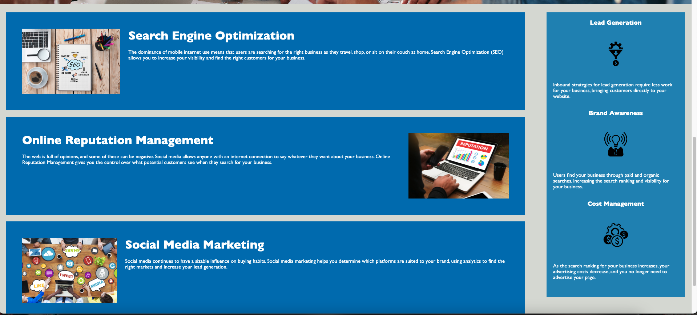

# ada-compliant

# HTML, CSS, and Git: Code Refactor

Took provided base code and inspected and refactored for semantic errors in HTML. By doing so, the code was more organized, easier to read, and more convenient to build CSS off of. The final product was a much shorter code for both HTML and CSS. While inspecting the code, learned how important it is to pay attention to what tags are being used in specific places and how that plays a role in its function.

## User Story:

```
AS A user of the website
I WANT to be able to toggle through the website with ease
SO THAT I can get the information that I need most efficiently.
```

## Acceptance Criteria:

```
GIVEN a code for a website
WHEN I load their website
THEN I can toggle through the webpage with tab
WHEN I click on each header tab it will take me to the corresponding section on the webpage
WHEN I scroll through the webpage
THEN I can see the separation in each component of the webpage
```

[Website](https://mintedd.github.io/ada-compliant/)




